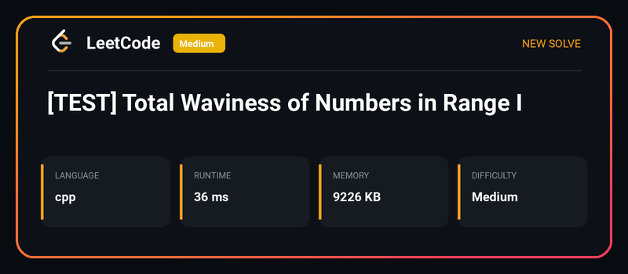
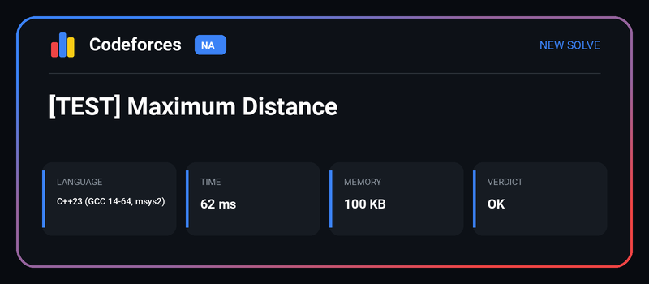
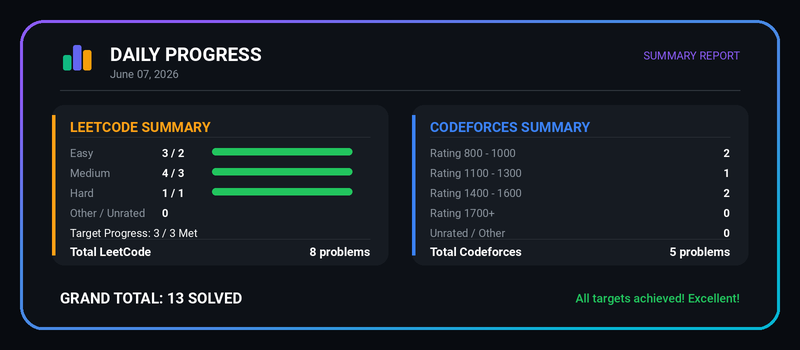

# Chronos Bot

Telegram bot that tracks and logs solved problems on **LeetCode** and **Codeforces**, and send them as image cards to a Telegram channel. It also provides private chat commands to query statistics and set daily, weekly, or monthly coding goals.

---

## 🖼️ Image Cards Preview

When `SEND_AS_IMAGE=True` is configured, the bot posts beautifully formatted image cards to the Telegram channel instead of standard text messages.

### Solve Cards

| LeetCode Solve Card | Codeforces Solve Card |
| :---: | :---: |
|  |  |

### Summary Cards

| Daily / Weekly / Monthly Progress Summary |
| :---: |
|  |

---

## 🤖 Available Bot Commands

All commands must be executed in a **private chat** with the bot.

| Command    | Usage                          | Description                                                                                      |
| :--------- | :----------------------------- | :----------------------------------------------------------------------------------------------- |
| `/ping`    | `/ping`                        | Checks bot latency and returns "Pong!".                                                          |
| `/stats`   | `/stats`                       | Returns your coding stats and progress towards targets for the **current day**.                  |
| `/wstats`  | `/wstats`                      | Returns your coding stats and progress towards targets for the **current week** (Monday–Sunday). |
| `/mstats`  | `/mstats`                      | Returns your coding stats and progress towards targets for the **current month**.                |
| `/pstats`  | `/pstats`                      | Returns your coding stats for **yesterday**.                                                     |
| `/pwstats` | `/pwstats`                     | Returns your coding stats for the **previous week**.                                             |
| `/dset`    | `/dset <easy> <medium> <hard>` | Sets your **daily** LeetCode targets (e.g., `/dset 2 1 0` for 2 Easy, 1 Medium, 0 Hard).         |
| `/wset`    | `/wset <easy> <medium> <hard>` | Sets your **weekly** LeetCode targets (e.g., `/wset 10 5 1` for 10 Easy, 5 Medium, 1 Hard).      |
| `/mset`    | `/mset <easy> <medium> <hard>` | Sets your **monthly** LeetCode targets (e.g., `/mset 40 20 5` for 40 Easy, 20 Medium, 5 Hard).   |

---

## ⚙️ Configuration

Check `.env.example` for details on how to set up the scraper credentials and configure features like `SEND_AS_IMAGE`.
